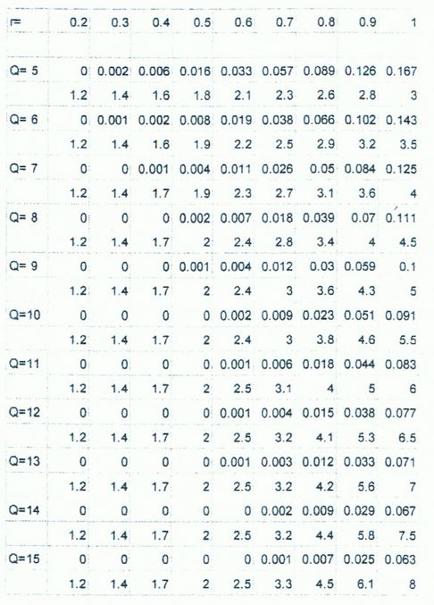

#Kolokwium 2009 - Zadanie 1

#### cechy zadania: zadanie z tabelą - średnich znormalizowanych opóźnienień systemowych

Dla 1-procesorowego ststemu kolejkowego, dla różnych wartości obciążenia r i pojemności Q, tabela podaje:
frakcję utraconych zgłoszeń L, a poniżej - znormalizowane średnie opóźnienie systemowe $$ \frac{d_{sr}}{\tau_{sr}} $$

Do systemu przybywa strumień zgłoszeń ze średnim interwałem $$ a_{sr} = 100ms $$ Zgłoszenie jest programem do przetworzenia zawierającym średnio
$$ b_{sr} = 1000 $$ lini kodu. Wydajność procesora wynosi $$ 12500 \frac{lini kodu}{s} $$ zaś dopuszczalna przez użytkowników frakcja utraconych zgłoszeń wynosi 
$$ L_{max} = 1 \% $$

a) jaka jest niezbędna pojemność systemu ?

b) Planowana jest instalacja procesora o wydajności większej od poprzedniego o $$ 33.3 \% $$. 
O ile sekund zostanie zredukowane średnie opóźnienie systemowe zgłoszenia i jaka będzie niezbędna do tego pojemność systemu ?

#### Dane

$$ b_{sr} = 1000 loc $$

$$ a_{sr} = 100ms = 0.1 s $$

$$ v = 12500 \frac{loc}{s} $$ 

$$ L_{max} = 1 \% $$

#### Rozwiązanie

###### A)

$$ r = \frac{b_{sr}}{a_{sr} * v} = \frac{1000 loc}{0.1s * 12500 \frac{loc}{s}} = 0.8 $$

w tabeli przy r = 0.8 wartość która spełnia warunek L <= 1% to ** Q = 14 **

###### B)

$$ v_2 = \frac{4}{3} * 12500 \frac{loc}{s} = \frac{50 000 loc}{3s} $$

$$ r_2 = \frac{b_{sr}}{a_{sr} * v_2} = \frac{1000 loc}{0.1s * \frac{50 000 loc}{3s}} = 0.6 $$
 
w tabeli przy r = 0.6 wartość która spełnia warunek L <= 1% to **Q = 8**

O ile sekund zostanie zredukowane średnie opóźnienie systemowe zgłoszenia ?

$$ \tau_{a} = \frac{b_{sr}}{v_1} = \frac{1000}{12 500} = 0.08s $$

$$ \tau_{b} = \frac{b_{sr}}{v_2} = \frac{1000}{\frac{50 000}{3}} = 0.06s $$

wiemy też że przy Q = 14 i $$ r_1 = 0.8 $$ stosunek $$ \frac{d_{sr}}{\tau_{sr}} = 4.4 $$ 
oraz że przy Q = 8 i $$ r_2 = 0.6 $$ stosunek $$ \frac{d_{sr}}{\tau_{sr}} = 2.4 $$ 

$$ d^{(1)}_{sr} = \tau_a * 4.4 = 0.352s $$

$$ d^{(2)}_{sr} = \tau_b * 2.4 = 0.144s $$

**średnie opóźnienie systemowe zgłoszenie zostanie zredukowane o 0.208s (59%) w przypadku zwiększenia procesora o 33.3%**