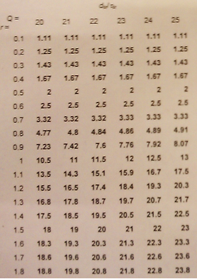

#Kolokwium 20YY - Zadanie 1

#### cechy zadania: zadanie z tabelą - średnich znormalizowanych opóźnienień systemowych

Dla 1-procesorowego systemu masowej obsługi tabela podaje znaormalizowane średnie opóźnienie systemowe w zależności od pojemności pamięci buforowej Q oraz współczynnika obciązenia r.
Mamy 8 użytkowników, z których każdy w ciągu sekundy generuje średnio 3 pliki tekstowe po 200KB. Procesor przetwarza pliki z prędkością 4.8 MB/s.

a) jakie będzie średnie opóźnienie systemowe ( w milisekundach ) przy pamięci buforowej o pojemności 22?

b) Do jakiej wartości wzrośnie ono po zwiększeniu liczby użutkowników do 12 ?

c) Ile wyniesie, gdy następnie prędkość przetwarzania w procesorze zwiększymy o połowę.

#### Dane

> $$ J = 8 $$ - użytkowników

> $$ a_{sr} = \frac{\frac{1}{3} s}{J} = \frac{1}{3}s * \frac{1}{8} = \frac{1}{24} s $$ 

> $$ b_{sr} = 200KB = 200KB $$

> $$ v = 4,8 MB/s = 4800 KB/s $$

> $$ Q = 22 $$

#### Rozwiązanie

###### A)

$$ r = \frac{b_{sr}}{a_{sr} * v} = \frac{200 KB}{\frac{1}{24} * 4800 KB/s} = 1 $$

$$ \tau_{sr} = \frac{b_{sr}}{v} = \frac{200 KB}{4800 KB/s} = \frac{1}{24} $$

z treści zadania: Q = 22, więc przy r = 1 stosunek $$ \frac{d_{sr}}{\tau_{sr}} = 11.5 $$

$$ d_{sr} = \tau_{sr} * 11.5 = \frac{1}{24} * 11.5 = 0.4791 s $$ = **479.1 milisekund**

###### B)

$$ J = 12 $$ 

$$ a^{(B)}_{sr} = \frac{\frac{1}{3}s}{J} = \frac{\frac{1}{3}s}{12} = \frac{1}{36} s $$

$$ r^{(B)} = \frac{b_{sr}}{a^{(B)}_{sr} * v} = \frac{200 KB}{\frac{1}{36} * 4800 KB/s} = 1.5 $$

$$ \tau_{sr} = \frac{b_{sr}}{v} = \frac{200 KB}{4800 KB/s} = \frac{1}{24} $$

z treści zadania: Q = 22, więc przy r = 1.5 stosunek $$ \frac{d_{sr}}{\tau_{sr}} = 20 $$

$$ d_{sr} = \tau_{sr} * 20 = \frac{1}{24} * 20 = \frac{5}{6} s = $$ **833 milisekund** 

###### C)

$$ v^{(C)} = 150\% * v = 7200KB/s $$

$$ r^{(C)} = \frac{b_{sr}}{a^{(B)}_{sr} * v^{(C)}} = \frac{200 KB}{\frac{1}{36} * 7200 KB/s} = 1 $$

$$ \tau_{sr} = \frac{b_{sr}}{v} = \frac{200 KB}{7200 KB/s} = \frac{1}{36} $$

z treści zadania: Q = 22, więc przy r = 1 stosunek $$ \frac{d_{sr}}{\tau_{sr}} = 11.5 $$

$$ d_{sr} = \tau_{sr} * 11.5 = \frac{1}{36} * 11.5 = 0.31944 s $$ **319.4 milisekund**

---

