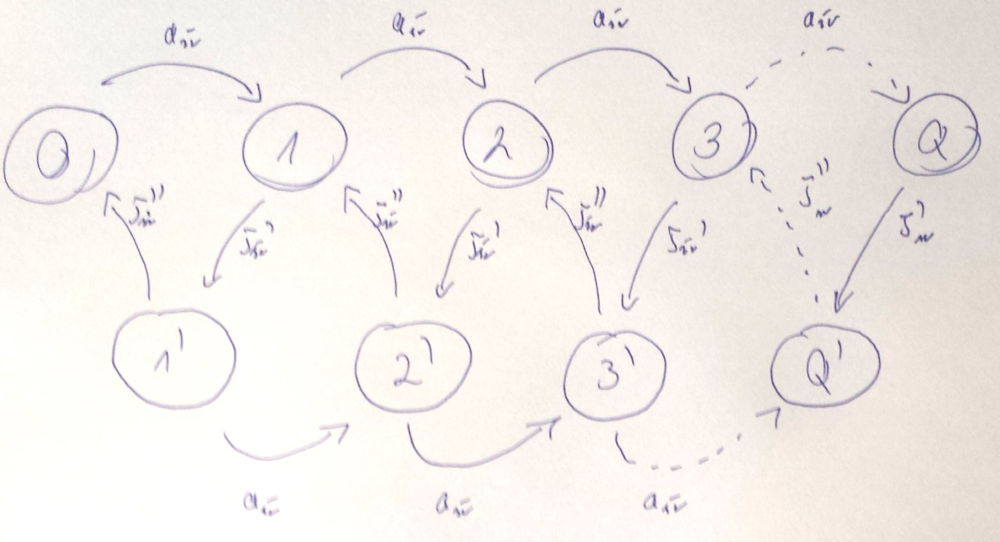

#Kolokwium 20YY - Zadanie 3

#### cechy zadania: zadanie z typu graf stanów

Do 1-procesorowego systemu masowej obsługi przybywa strumień Poissona zgłoszeń ze średnim interwałem $$ a_{sr} $$.
Obsługa zgłoszenia składa się z dwóch kolejnych faz o wykładniczych rozkładach czasu trwania ze średnim 
$$ \tau^{(`)}_{sr} $$, $$ \tau^{(``)}_{sr} $$.

Narysuj graf przejść stanów dla odpowiedniego procesu urodzin i śmierci.

