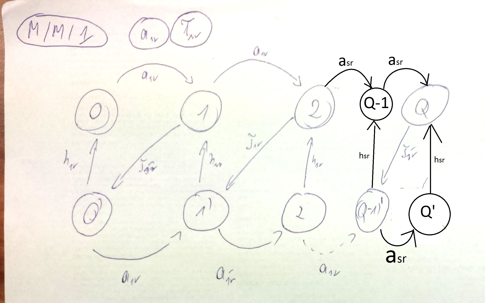

#Kolokwium 2013 - Zadanie 3

#### cechy zadania: zadanie typu graf stanów

Do systemu M/M/1 przybywają zgłoszenia ze średnim interwałem  $$ a_{sr} $$ i średnim czasem obsługi $$ t_sr $$.
Narysuj graf przejść stanów odpowiedniego procesu narodzin i śmierci w przypadku gdy każdorazowo po zakończeniu obsługi zgłoszenia procesor "idzie na wakacje" w trakcie których ignoruje znajdujące się w systemie zgłoszenia;
czas trwania "wakacji" ma rozkład wykładniczy ze średnią $$ h_{sr} $$

#### Rozwiązanie

