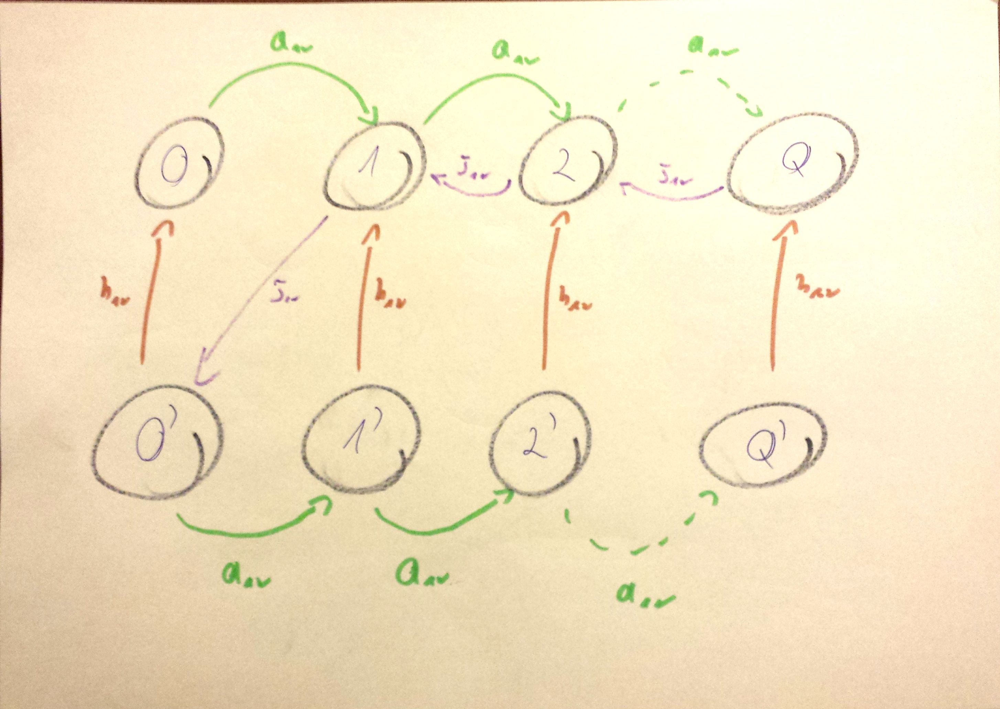

#Kolokwium 2014 - wrzesień - Zadanie 3

#### cechy zadania: zadanie typu graf stanów

Do systemu M/M/1 przybywa strumień zgłoszeń ze średnim interwałem $$ a_{sr} $$ i średnim wymaganiem zgłoszenia $$ b_{sr} $$, Wydajność procesora wynosi v.
Narysuj odpowiedni graf przejść stanów dla procesu urodzin i śmierci w przypadku, gdy po zakończeniu okresu zajętości procesor "idzie na wakacje", w trakcie których ignoruje zgłoszenia;
czas trwania "wakacji" ma rozkład wykładniczy ze średnią $$ h_{sr} $$

#### Rozwiązanie

