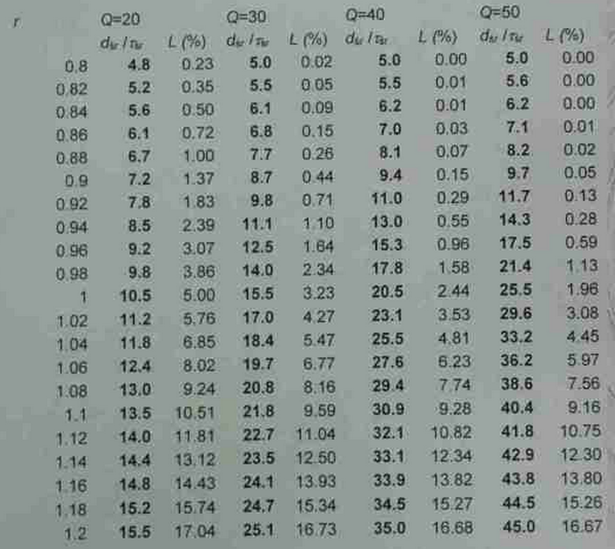

#Kolokwium 2014 - Zadanie 1

#### cechy zadania: zadanie z tabelą - średnich znormalizowanych opóźnienień systemowych

1-procesorowy system kolejkowy o skończonej pojemności ma przyjmować raporty z 20 końcówek telemetrycznych.
Każda końcówka generuje średnio 30 raportów na minutę o średnim rozmiarze raportu 1040 rekordów. Dopuszcza się średnie opóźnienie systemowe raportu do 2.7s oraz do 5% raportów utraconych wskutek przepełnienia.
Dostępne są procesory o wydajności v = 9600, 10000 i 10400 rekordów/s oraz pojemności pamięci buforowej Q = 20, 30, 40 i 50 raportów.

Dobierz najmniejsze możliwe Q i v przy powyższych ograniczeniach. Jaki będzie współczynnik obciążenia procesora ?

W tabeli pokazano średnie opóźnienia systemowe znormalizowane względem średniego czasu przetwarzania raportu oraz frakcje strat dla różnych Q i współczynników obciążenia procesora r.

#### Dane

> $$ J = 20 $$ - końcówek telemetrycznych

> $$ b_{sr} = 1040 rek $$ - średni rozmiar jednego zgłoszenia.

> $$ a_{sr} = $$ co 2 sekundy jedna końcówka daje zgłoszenie / liczba końcówek $$ = \frac{2}{20} = 0.1 $$ - interwał pomiędzy zgłoszeniami 

> $$ L \le 5\% $$ - dopuszczana frakcja strat wskutek przepełnienia.

> $$ d_{sr} $$ - dopuszczane opóźnienie systemowe.

> $$ v_1 = 10400 \frac{rek}{s} $$, $$ v_2 = 10000 \frac{rek}{s} $$, $$ v_3 = 9600 \frac{rek}{s} $$

> $$ Q_1 = 20 $$, $$ Q_2 = 30 $$,$$ Q_3 = 40 $$,$$ Q_4 = 50 $$

#### Rozwiązanie

**szukamy najmniejszego Q i v spełniającego założenia związane z $$ L $$ i $$ d_{sr} $$**

#### procesor - $$ v_1 $$

$$ r_1 = \frac{b_{sr}}{a_{sr} * v_1} = \frac{1040}{0.1 * 10400} = 1 $$

najmniejsze Q spełniające warunek $$ L \le 5\% $$ to $$ Q_1 (20) $$

$$ \tau_{sr} = \frac{b_{sr}}{v_1} = \frac{1040}{10400} = 0.1s $$ 

$$ \frac{d_{sr}}{\tau_{sr}} = 10.5 \Rightarrow d_{sr} = 0.1s * 10.5 = 1.05s \le 2.7s $$

#### procesor - $$ v_2 $$

$$ r_2 = \frac{b_{sr}}{a_{sr} * v_2} = \frac{1040}{0.1 * 10000} = 1.04 $$

najmniejsze Q spełniające warunek $$ L \le 5\% $$ to $$ Q_3 (40) $$

$$ \tau_{sr} = \frac{b_{sr}}{v_2} = \frac{1040}{10000} = 0.104s $$

$$ \frac{d_{sr}}{\tau_{sr}} = 25.5 \Rightarrow d_{sr} = 0.104s * 25.5 = 2.652s \le 2.7s $$

#### procesor - $$ v_3 $$

$$ r_3 = \frac{b_{sr}}{a_{sr} * v_3} = \frac{1040}{0.1 * 9600} = 1.083 $$

nie istnieje Q spełniające warunek $$ L \le 5\% $$ 

----
> note treść zadania nie informuje nas co mamy minimalizować najpierw czy Q czy v.

**Odpowiedź:** minimalizując jednocześnie w równym stopniu Q oraz V. możemy w systemie zastosować $$ v_1 $$ i **$$ Q_1 $$** lub **$$ v_2 $$** i $$ Q_3 $$ oby dwie konfiguracje spełnią nażucane systemowi wymagania. 

 
