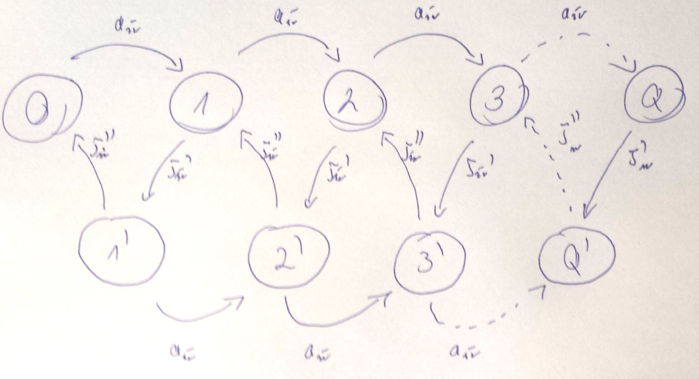

#Kolokwium 2014 - Zadanie 3

#### cechy zadania: zadanie typu graf stanów

Do 1-procesorowego systemu masowej obsługi przybywa strumień Poissona zgłoszeń ze średnim interwałem $$ a_{sr} $$. 
Obsługa zgłoszenia składa się z dwóch następujących po sobie faz o wykładniczych rozkładach czasu trwania ze średnimi odpowiednio $$ \tau^{(')}_{sr} $$ i $$ \tau^{('')}_{sr} $$

Narysuj graf przejść stanów dla odpowiedniego procesu urodzin i śmierci.

