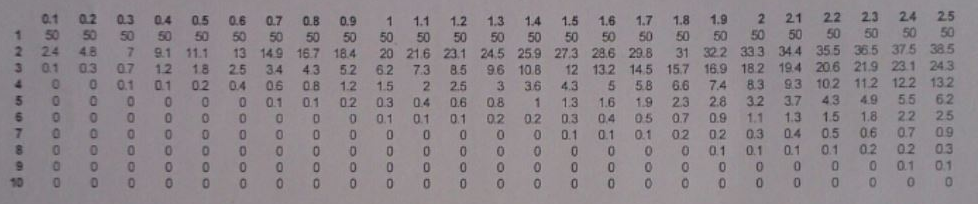
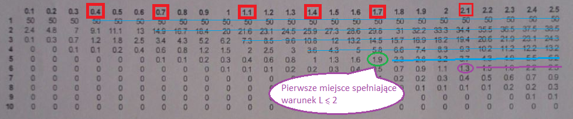

#Kolokwium 2015 - Zadanie 1

##### cechy zadania: zadanie typu M/M/S/S

W systemie M/M/S/S każdy użytkownik generuje średnio w ciągu 1000 s jedno połączenia głosowe o średnim, czasie trwania 50s, dopuszczając frakcję strat $$ L \le 2\% $$ wskutek braku wolnych lini. Operator systemu pobiera od każdego dołączonego użytkownika stałą połatę miesięczną
$150 , zaś za wydzierżawienie lini płaci stałą opłatę $1000. Jaką minimalną liczną linie powinien wydzierżawić i ilu użytkowników powinien dołączyć, by system zaczął przynosić zysk?
 W poniższej tabeli formuły B Erlanga podano L ( w %) dla normatywnego współczynnika obciążenia $$ \rho = 0.1 ... 2.5 $$ ernangla oraz liczby nini $$ S = 1 ... 10 $$

Tabela formuły B Erlanga:

#### Dane

> $$ a_{sr} = 1000 s $$ - interwał pomiędzy zgłoszeniami jednego użytkownika

> $$ \tau_{sr} = 50 s $$ - średni wymagany czas obsługi jednego zgłoszenia

> $$ L \le 2\% $$ - dopuszczana frakcja strat wskutek braku wolnych lini

> $$ 150 \$ $$ - zysk z jednego użytkownika 

> $$ 1000 \$ $$ - koszt jednej lini

> $$ U $$ - liczba użytkowników

> $$ S $$ - liczba lini

#### Rozwiązanie #1

$$ \rho = \frac{\tau_{sr}}{a_{sr}} = 0.05 $$ - normatywny współczynnik obciążenia - obciążenie jakie generuje jeden użytkownik na jednym procesorze.

$$ \frac{\rho_{z tabeli}}{\rho} $$ = U

$$ 150 * U - 1000 * S > 0 $$

$$ U  > \frac{1000}{150} S $$

$$ U  > \frac{20}{3} S $$

$$ \frac{\rho_{z tabeli}}{\rho} > \frac{20}{3} S $$ 

$$ \rho_{z tabeli} > \rho * \frac{20}{3} S $$

$$ \rho_{z tabeli} > 0.05 * \frac{20}{3} S $$

$$ \rho_{z tabeli} > \frac{1}{3} S $$ - zależność między $$ \rho $$ a $$ S $$ 

| $$ S $$                                      |      1      |      2      |      3      |       4     |      5      |      6      |
|:--------------------------------------------:|:-----------:|:-----------:|:-----------:|:-----------:|:-----------:|:-----------:|
|$$ \frac{1}{3} S $$                           | $$\frac{1}{3}$$ | $$\frac{2}{3}$$ | $$ 1 $$          | $$\frac{4}{3}$$ | $$ \frac{5}{3} $$ | $$ \frac{6}{3} $$ |
| $$ \rho_{z tabeli} > \frac{1}{3} S  $$       | 0.4         | 0.7         | 1.1         | 1.4         | 1.7         | 2.1         |

szukamy w tabeli miejsc gdzie spełniany jest warunek $$ L \le 2\% $$

------
**Odp**: najmniejsza liczba lini by system przynosił zysk to 5 (34 użytkowników)

#### Rozwiązanie #2 - Sprawdzanie iteracyjne

$$ \rho = \frac{\tau_{sr}}{a_{sr}} = 0.05 $$ - normatywny współczynnik obciążenia - obciążenie jakie generuje jeden użytkownik na jednym procesorze.

widzimy z tabeli iż S=1, S=2 nigdy nie spełniają warunków $$ L \le 2\% $$

sprawdzamy dla S = 3

$$ \frac{\rho_{z tabeli}}{\rho} $$ = U

$$ \frac{\rho_{z tabeli}}{\rho} = \frac{0.5}{0.05} = 10 $$ - użytkowników

$$ 150 * U - 1000 * S = 1500 - 3000 = -1500\$ $$

sprawdzamy dla S = 4

$$ \frac{\rho_{z tabeli}}{\rho} $$ = U

$$ \frac{\rho_{z tabeli}}{\rho} = \frac{1.1}{0.05} = 22 $$ - użytkowników

$$ 150 * U - 1000 * S = 3300 - 4000 = -700\$ $$

sprawdzamy dla S = 5

$$ \frac{\rho_{z tabeli}}{\rho} $$ = U

$$ \frac{\rho_{z tabeli}}{\rho} = \frac{1.7}{0.05} = 34 $$ - użytkowników

$$ 150 * U - 1000 * S = 5100 - 5000 = + 100\$ $$ 

------
**Odp**: najmniejsza liczba lini by system przynosił zysk to 5 (34 użytkowników)