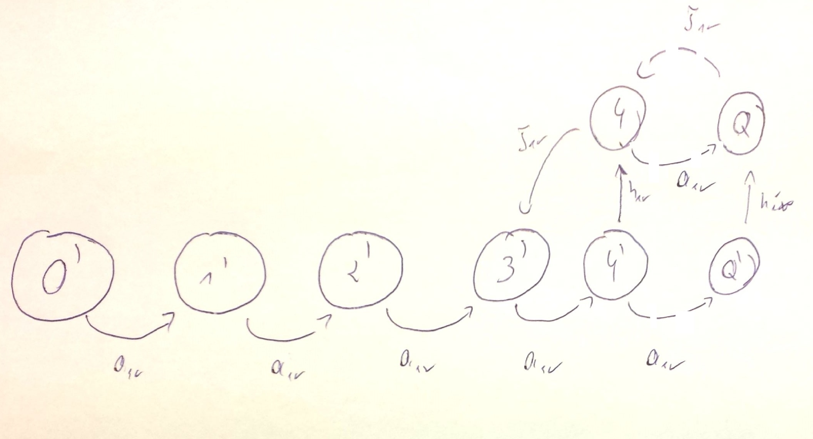

#Kolokwium 2015 - Zadanie 2

#### cechy zadania: zadanie typu graf stanów

w systemie M/M/1 parametry strumienia zgłoszeń wynoszą $$ a_{sr} $$ i $$ b_{sr} $$ zaś wydajność procesora wynosi $$ v $$ 
Narysuj graf przejść stanów procesu urodzin i śmierci dla następującego modelu z wakacjami.
Każdorazowo po zakończeniu obsługi zgłoszenia lub kolejnych wakacji procesor sprawdza liczbę zgłoszeń w systemie i jeżeli nie przekracza ona 3, udaje się na wakacje, w trakcie których nie obsługuje zgłoszeń; 
w przeciwnym razie obsługuje kolejne zgłoszenie. Czas trwania wakacji ma rozkład wykładniczy ze średnią $$ h_{sr} $$

#### Rozwiązanie

Opis:

Każdorazowo po **zakończeni obsługi zgłoszenia** lub **kolejnych wakacji** procesor idzie na wakacje jeśli liczba zgłoszeń w systemie wynosi **0, 1, 2, 3**  (nie rysujemy przejść "do siebie")

Jeśli system jest w stanach 4,5 lub 6... i skończy wakacje rozpoczyna normalną pracę

system pracuje tak długo normalnie aż nie zejdzie z ilością zgłoszeń do 3 wtedy rozpoczyna wieczne wakacje tak długo aż nie otrzyma kolejnego (4 go) zadania. (może się zdarzyć ze otrzyma 2 3 lub 4... zadania więc stany 5' 6' 7' Q' są możliwe)     

w stanie **4'** wyjdzie poza warunek wiecznych wakacji przeczeka jeszcze jedną kolejkę wakacji i spowrotem do normalnej pracy