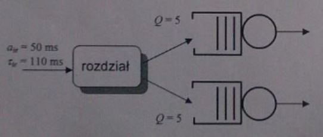

#Kolokwium 2015 - Zadanie 3

Strumień Poissona ze średnim interwałem $$ a_{sr} = 50ms $$ i wykładniczym rozkladem wymagań zgłoszeń ze średnią $$ \tau_{sr} = 110ms $$ 
rozdzielany jest na dwa systemy o pojemności $$ Q = 5 $$ jak na rysunku.

Oblicz frakcję strat $$ L $$ dla dwóch trybów pracy:

a) dla każdego zgłoszenia wybór systemu jest przypadkowy z prawdopodobieństwami 50%

b) do każdego systemu trafia połowa każdego zgłoszenia.

Który tryb pracy wprowadza większe średnie opóźnienie systemowe ?

#### Dane

> $$ a_{sr} = 50ms $$

> $$ \tau_{sr} = 110ms $$

> $$ Q = 5 $$

#### Rozwiązanie

$$ r = \frac{b_{sr}}{a_{sr} * v} $$

$$ \tau_{sr} = \frac{b_{sr}}{v} $$

$$ r = \frac{\tau_{sr}}{a_{sr}} $$

$$ L = \frac{ 1 - r }{1 - r^{Q+1}} * r^Q $$

###### A
> note: można interpretować system jako system M/M/1 dlatego mogę stosować wzór na L

$$ a^{(A)}_{sr} = a_{sr} * 2 $$ - losowe rozrzedzanie - strumien poissona

$$ r^{(A)} = \frac{\tau_{sr}}{a^{(A)}_{sr}} = \frac{110}{50 * 2} = 1.1 $$

$$ L = \frac{1 - (1.1)}{1-(1.1)^6} * (1.1)^5 = 0.2087 = 20.87 \%$$

###### B
> note: można interpretować system jako system M/M/1 dlatego mogę stosować wzór na L

$$ \tau_{sr} = \frac{b_{sr}}{v} $$

$$ \tau^{(B)}_{sr} = \frac{\frac{b_{sr}}{2}}{v} = \frac{\tau_{sr}}{2} $$

$$ r^{(B)} = \frac{\tau^{(B)}_{sr}}{a_{sr}} = \frac{\frac{110}{2}}{50} = 1.1 $$

$$ L = \frac{1 - (1.1)}{1-(1.1)^6} * (1.1)^5 = 0.2087 = 20.87 \%$$

**Który tryb pracy wprowadza większe średnie opóźnienie systemowe ?**

$$ N_{sr} = \frac{1-L}{a_{sr}} * d_{sr} \Rightarrow d_{sr} = \frac{N_{sr} * a_{sr}}{(1-L)} $$
 
$$ d_{sr} = \frac{N_{sr} * a_{sr}}{(1-L)} $$

w oby dwóch trybach pracy $$ \frac{N_{sr}}{(1-L)} $$ jest stałe, a $$ a_{sr} $$ jest zmienne.
 
wystarczy porównać $$ a_{sr} $$ obydwu trybów pracy by porównać między sobą opóźnienia systemowe.

A) $$ a^{(A)}_{sr} = a_{sr} * 2 $$

B) $$ a^{(B)}_{sr} = a_{sr} $$

$$ a^{(A)}_{sr} > a^{(B)}_{sr} \Rightarrow d^{(A)}_{sr} > d^{(B)}_{sr} $$

---
**Odp**: większe opóźnienie systemowe wprowadza pierwszy tryb pracy.