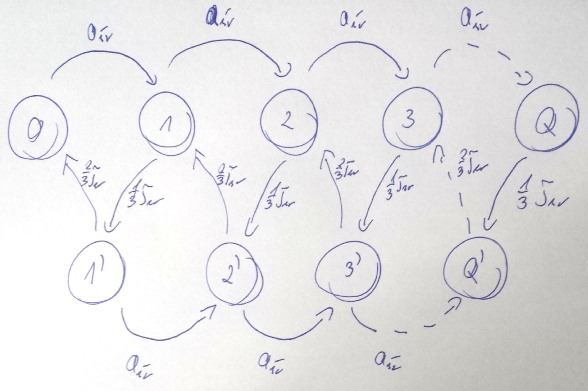

#Kolokwium 20XX - Zadanie 2

#### cechy zadania: zadanie z typu graf stanów

Do 1-procesorowego systemu masowej obsługi przybywa strumień Poissona zgłoszeń ze średnim interwałem $$ a_{sr} $$ i średnim czasem obsługi zgłoszenia 
$$ \tau{sr} $$ Obsługa zgłoszenia składa się z dwóch natępujących po sobie faz o wykładniczych rozkładach czasu trwania ze średnimi odpowiednio
$$ \frac{\tau{sr}}{3} $$ i $$ \frac{2\tau{sr}}{3} $$. Narysuj Graf przejść stanów dla procesu urodzin i śmierci.
 
